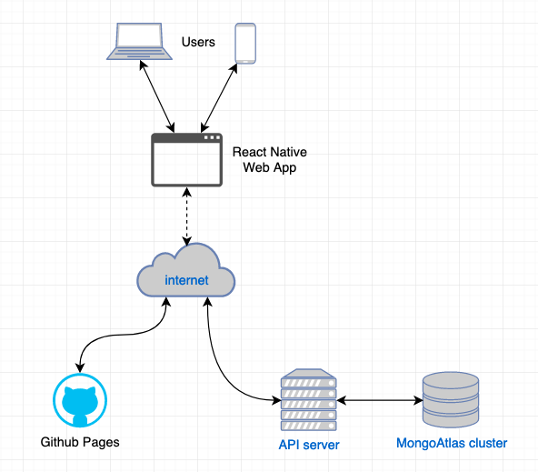

The following contributors created and devleped the api and app services as their capstone project during the 2020 Autumn semester.

## Contributers

- Nick Hackman : [@NickHackman](https://github.com/NickHackman){:target="_blank"}
- Addison Freeman : [@freeman91](https://github.com/freeman91){:target="_blank"}
- Adam Claus : [@claus44](https://github.com/claus44){:target="_blank"}
- Nick Lamanna : [@nlamanna18](https://github.com/nlamanna18){:target="_blank"}

## Purpose

The purpose of these services is to provide health care workers an application that contains a repository of curated information related to specific culture groups in order to help them better serve their patients.

## Development Environment

The following packages need to be installed on the dev machine:

- [Docker](https://docs.docker.com/get-docker/)
- [python 3.8](https://www.python.org/downloads/) 
- [node](https://nodejs.org/en/download/)
- [expo-cli](https://docs.expo.io/get-started/installation/)
- [mongodb](https://docs.mongodb.com/guides/server/install/)  (optional)

- [Instructions](https://github.com/OSUMC-Cultural-Awareness/api#getting-started) for setting up api service
- [Instructions](https://github.com/OSUMC-Cultural-Awareness/app#getting-started) for setting up app service

## Production Environment

### Interactions
- Github Pages is serving the frontend React Native Application (web version) to users' devices at [https://osumc-cultural-awareness.github.io/app/](https://osumc-cultural-awareness.github.io/app/).  
- The React Native App then makes API calls to the API server at [https://www.osumc-cultural-awareness.com/](https://www.osumc-cultural-awareness.com/health) that sits on an EC2 instance.  
- The API server connects to and manages data on a MongoAtlas cloud cluster.
