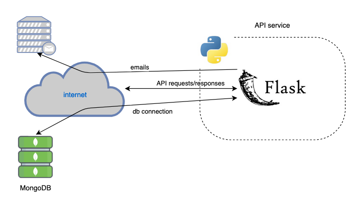
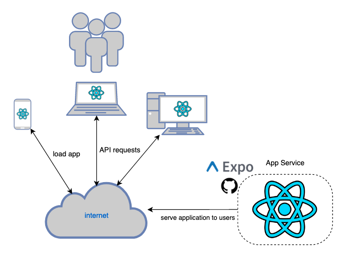

## API service

The following are the primary technologies used for the API service:
### MongoDB
[Mongodb](https://www.mongodb.com/) is a general purpose, document-based, NoSQL, distributed database built for modern application developers.  
Utilizing a MongoDB Atlas free-tire cluster in our production environment.  
MongoDB Atlas is multi-cloud database service that automatically manages our database.

### Python-Flask 
[Python-Flask](https://flask.palletsprojects.com/en/1.1.x/) is a web application framework that handles API requests, processes those requests by fetching data from the database or modifying data in the database, then returns a response to the caller of the API request.

### JSON Web Tokens
[JSON Web Tokens](https://jwt.io/) are an open, industry standard method for representing claims securely between two parties. We are using JWT's for user authorization. e.g. when an admin logs into the application, their browser receives a JWT and uses it on subsequent API calls that require authorization. 

## Frontend Service

The following are the primary technologies used for the frontend service:
### React Native on Typescript
[React Native](https://reactnative.dev/) is an open-source mobile application framework for building user interfaces on modern mobile operating systems and web browsers.  
[Typescript](https://www.typescriptlang.org/) is an extension of [Javascript](https://www.javascript.com/) (and compiles to javascript) that adds optional static typing of the language.

### React Native Paper
[React Native Paper](https://reactnativepaper.com/) is a high-quality, standard-compliant [Material Design]() library that has a React Native Component for all major use cases.

### Redux
[Redux](https://redux.js.org/) is a predicatable state contatiner for javascript applications. Provides the application with a state that is available to components. e.g. when a user logs in, the JWT they receive from the API is stored in the state.
